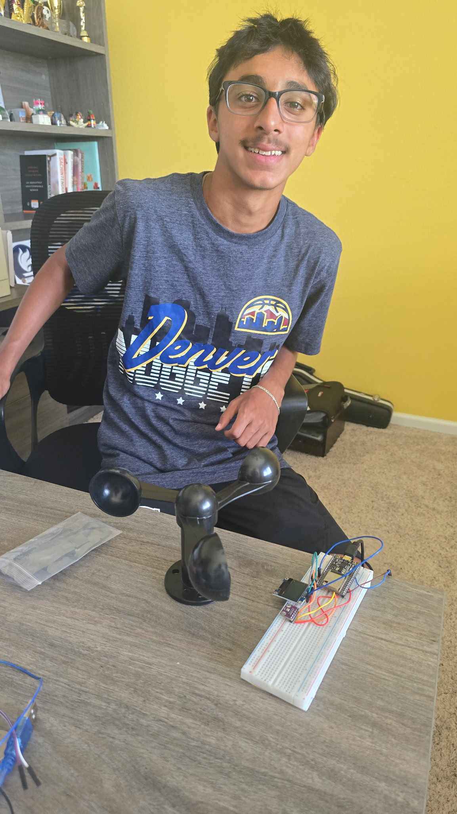

# ESP32 Weather Station 
My project is an ESP32-based weather station that collects and displays real-time environmental data, including wind speed, temperature, humidity, air pressure, and altitude. Using an ESP32 Dev Module, a BME280 sensor, a 0.96-inch OLED display, and an anemometer, I built a  system capable of monitoring local weather conditions. Throughout the project, I overcame both hardware and programming challenges while learning how to troubleshoot Arduino in different ways, I integrated multiple sensors, and developed a reliable weather monitoring device. My experience from this was very valuable, and I truly learned a lot. 


| **Engineer** | **School** | **Area of Interest** | **Grade** |
|:--:|:--:|:--:|:--:|
| Vivaan D | Rock Canyon High School| Physics and Mechanical Engineering | Incoming Sophomore



  
# Final Milestone


<iframe width="560" height="315" src="https://www.youtube.com/embed/N9zQ_0GdV4w?si=JeCczo9aOJd6tGZL" title="YouTube video player" frameborder="0" allow="accelerometer; autoplay; clipboard-write; encrypted-media; gyroscope; picture-in-picture; web-share" referrerpolicy="strict-origin-when-cross-origin" allowfullscreen></iframe>

For my final milestone, I wrapped everything up. I finally got my anemometer to work, and I successfully programmed my OLED Display Module to display the wind speed in km/h, mph, and m/s. The wiring was a little challenging because the main issue was stripping the wires. This was my first time stripping wires with scissors, and if I cut too deeply, I would accidentally cut the wire itself.

There were two separate layers to strip. The first layer was a thick black outer covering that protected the black and brown wires. After removing that outer covering, I had to strip the black and brown wires individually. This was even more difficult because the wires were very small, so even a slight cut could damage them. It took me about 20–30 minutes to strip the wires successfully. Once I finished stripping the wires, I ran into another issue with my circuitry. Originally, I thought one wire needed to be connected to a digital pin and the other to ground. However, just like my other components, the anemometer required the brown wire to be connected to a specific GPIO pin. After doing some research, I discovered that the brown wire needed to be connected to GPIO 34. Once I made that change, my code and my entire project worked perfectly. Since my OLED Display Module is very small, I didn't have enough room to display all of my weather data at once. To solve this problem, I modified my code so the display switches between the BME280 sensor data and the wind information every two seconds. The sensor readings also update every two seconds, allowing all of the information to be displayed clearly without overcrowding the screen. Overall, I'm really excited for Demo Night, and I can't wait to showcase my project.


# Second Milestone


<iframe width="560" height="315" src="https://www.youtube.com/embed/0BI4hMMGP38?si=qVwjkcHxG7Az2sML" title="YouTube video player" frameborder="0" allow="accelerometer; autoplay; clipboard-write; encrypted-media; gyroscope; picture-in-picture; web-share" referrerpolicy="strict-origin-when-cross-origin" allowfullscreen></iframe>

My second milestone went much better than my first, and I accomplished a lot this week. To start, I finally solved the problems I had been facing. My ESP32 board began receiving data from my computer correctly, and my code was finally working as intended. The main challenge during this milestone was the circuitry. Since my ESP32 board is slightly different from the standard version, I had to use a specific type of wire that could fit underneath the ESP32 and still connect to the breadboard. At first, my OLED display module would not turn on, but I eventually discovered that the issue was caused by incorrect wiring. Both the OLED display module and the BME280 sensor use GPIO pins 21 and 22, which are the default I2C communication pins on the ESP32. These pins allow the ESP32 to transfer data to both devices. Because I did not have enough space on my breadboard, I had to use the specialized jumper wires to connect underneath the ESP32 and into the breadboard rails. As long as the rails are connected to the correct data pins, power, voltage, and data can all be distributed and transferred throughout the breadboard and the rest of the circuit. The code itself was quite simple, and once I finished it, everything worked perfectly. I programmed the weather station to update its readings every two seconds so users have enough time to view the data without having to wait too long for fresh measurements. Looking ahead, I am looking forward to start working on my modification. My main addition will be an anemometer, which will allow the weather station to measure wind speed. I plan to display the wind speed in multiple units, including miles per hour, kilometers per hour, and meters per second.


# First Milestone


<iframe width="560" height="315" src="https://www.youtube.com/embed/aEf3GukpSwU?si=DCKOJWaheYtPWD5-" title="YouTube video player" frameborder="0" allow="accelerometer; autoplay; clipboard-write; encrypted-media; gyroscope; picture-in-picture; web-share" referrerpolicy="strict-origin-when-cross-origin" allowfullscreen></iframe>


For my first milestone, almost everything went wrong. My original plan was to finish half of my code and the majority of my circuitry, but instead I ran into a lot of errors. To start off, my project is an ESP32 weather station, and I chose this project to make an impact on my community and help it in a meaningful way. Unfortunately, I made no progress on my circuitry or code this entire week, but I learned a lot about different ways of debugging problems and the creative solutions that I can use. There were many problems that I faced this week, the main one being that my computer would not pick up the readings from my ESP32. Eventually, we found out that it was a driver issue, so we ended up downloading the correct driver, which was the CP210x driver. After installing it, my code finally uploaded, and the board was able to receive the data from my computer. Originally, I had selected the wrong board for my setup, so I thought that was the issue, but that turned out to be just one small piece of the puzzle. While that was one error, the main issue was that we didn't have the correct driver installed, and we were also missing a few components. For my Milestone 2 goals, I am looking to finish the entirety of my base project. This includes getting my ESP32 connected and getting the BME280 sensor to display live data on my 0.96-inch OLED display module.


# Code

```c++
/*
  BORDSTRACT Wind Speed Detector + BME280 Weather Station -> ESP32 -> 0.96" OLED
*/
// Including libraries
#include <Wire.h>
#include <Adafruit_Sensor.h>
#include <Adafruit_BME280.h>
#include <Adafruit_GFX.h>
#include <Adafruit_SSD1306.h>

// ---- OLED setup ----
#define SCREEN_WIDTH 128
#define SCREEN_HEIGHT 64
#define OLED_RESET -1
#define SCREEN_ADDRESS 0x3C  
Adafruit_SSD1306 display(SCREEN_WIDTH, SCREEN_HEIGHT, &Wire, OLED_RESET);

// ---- BME280 setup ----
Adafruit_BME280 bme; // I2C
#define SEALEVELPRESSURE_HPA (1013.25)

// ---- Anemometer setup ----
const int anemometerPin = 34;        
const float adcMaxVoltage = 3.3;    
const int adcResolution = 4095;     
const float dividerRatio = 5.6 / (1.0 + 5.6); 

// ---- Calibration (update after testing your unit) ----
const float minVoltage = 0.0;        
const float maxVoltage = 3.8;       
const float maxWindSpeed = 30.0;     
const float mps_to_kmh = 3.6;
const float mps_to_mph = 2.23694;

const int numSamples = 10;         

// ---- Page switching ----
unsigned long lastPageSwitch = 0;
const unsigned long pageInterval = 3000; // 3 seconds per page
int currentPage = 0; // 0 = weather, 1 = wind

// ---- Sensor readings, updated every loop, displayed depending on page ----
float tempF, humidity, pressure, altitude;
float windVoltage, windSpeedMps, windSpeedKmh, windSpeedMph;

float readSensorVoltage() {
  long sum = 0;
  for (int i = 0; i < numSamples; i++) {
    sum += analogRead(anemometerPin);
    delay(2);
  }
  float avgReading = (float)sum / numSamples;
  float pinVoltage = (avgReading / adcResolution) * adcMaxVoltage;
  return pinVoltage / dividerRatio;  // undo the divider to get sensor's real voltage
}

float voltageToWindSpeed(float voltage) {
  if (voltage < minVoltage) voltage = minVoltage;
  if (voltage > maxVoltage) voltage = maxVoltage;
  return (voltage - minVoltage) * (maxWindSpeed / (maxVoltage - minVoltage));
}

void updateReadings() {
  // BME280
  tempF = (bme.readTemperature() * 9.0 / 5.0) + 32.0;
  humidity = bme.readHumidity();
  pressure = bme.readPressure() / 100.0F; // hPa
  altitude = bme.readAltitude(SEALEVELPRESSURE_HPA);

  // Anemometer
  windVoltage = readSensorVoltage();
  windSpeedMps = voltageToWindSpeed(windVoltage);
  windSpeedKmh = windSpeedMps * mps_to_kmh;
  windSpeedMph = windSpeedMps * mps_to_mph;
}

void printToSerial() {
  Serial.print("Temp: "); Serial.print(tempF); Serial.println(" *F");
  Serial.print("Humidity: "); Serial.print(humidity); Serial.println(" %");
  Serial.print("Pressure: "); Serial.print(pressure); Serial.println(" hPa");
  Serial.print("Altitude: "); Serial.print(altitude); Serial.println(" m");
  Serial.print("Wind voltage: "); Serial.print(windVoltage, 3); Serial.println(" V");
  Serial.print("Wind speed: "); Serial.print(windSpeedMps, 2); Serial.println(" m/s");
  Serial.println("-------------------------------------");
}

void showWeatherPage() {
  display.clearDisplay();
  display.setTextSize(1);
  display.setTextColor(SSD1306_WHITE);

  display.setCursor(0, 0);
  display.println("--- WEATHER ---");

  display.setCursor(0, 16);
  display.print("Temp:  "); display.print(tempF, 1); display.println(" F");

  display.setCursor(0, 28);
  display.print("Hum:   "); display.print(humidity, 1); display.println(" %");

  display.setCursor(0, 40);
  display.print("Pres:  "); display.print(pressure, 1); display.println(" hPa");

  display.setCursor(0, 52);
  display.print("Alt:   "); display.print(altitude, 1); display.println(" m");

  display.display();
}

void showWindPage() {
  display.clearDisplay();
  display.setTextSize(1);
  display.setTextColor(SSD1306_WHITE);

  display.setCursor(0, 0);
  display.println("--- WIND SPEED ---");

  display.setCursor(0, 16);
  display.print("Voltage: "); display.print(windVoltage, 2); display.println(" V");

  display.setTextSize(2);
  display.setCursor(0, 28);
  display.print(windSpeedMps, 1);
  display.println(" m/s");

  display.setTextSize(1);
  display.setCursor(0, 48);
  display.print(windSpeedKmh, 1); display.print(" km/h  ");

  display.setCursor(0, 56);
  display.print(windSpeedMph, 1); display.println(" mph");

  display.display();
}

void setup() {
  Serial.begin(115200);
  delay(500);

  // Shared I2C bus for BME280 and OLED
  Wire.begin(21, 22); // SDA = GPIO21, SCL = GPIO22

  // ADC setup for anemometer
  analogReadResolution(12);
  analogSetPinAttenuation(anemometerPin, ADC_11db); // allows reading up to ~3.3V

  // Initialize BME280
  if (!bme.begin(0x76)) {
    Serial.println("Could not find a valid BME280 sensor, check wiring!");
    while (1);
  }

  // Initialize OLED
  if (!display.begin(SSD1306_SWITCHCAPVCC, SCREEN_ADDRESS)) {
    Serial.println("OLED allocation failed");
    for (;;);
  }

  display.clearDisplay();
  display.setTextColor(SSD1306_WHITE);
  display.setTextSize(1);
  display.setCursor(0, 0);
  display.println("Weather Station");
  display.println("Starting...");
  display.display();
  delay(1500);

  lastPageSwitch = millis();
}

void loop() {
  updateReadings();
  printToSerial();

  // Switch pages every 3 seconds without blocking
  if (millis() - lastPageSwitch >= pageInterval) {
    currentPage = (currentPage + 1) % 2;
    lastPageSwitch = millis();
  }

  if (currentPage == 0) {
    showWeatherPage();
  } else {
    showWindPage();
  }

  delay(200); // 
}
```
# Bill of Materials 

| **Part** | **Note** | **Price** | **Link** |
|:--:|:--:|:--:|:--:|
| ESP32 |This item is the main board that controls the data which is coming from other sensors. | $15.19 | <a href="https://www.amazon.com/HiLetgo-ESP32-DevKitC-ESP32-WROOM-32U-ESP-WROOM-32U-Development/dp/B09KLS2YB3/ref=sr_1_2_sspa?crid=RZS0VO0FHLVG&dib=eyJ2IjoiMSJ9.UdLxS8engRob9RiEzo8GfUX_eb5SIivviByIHACD0jgBzVFD5MSKwRvt2HMUQ7jFwjmW8ZG0IeuXxh15af8FtOTBMtuZxzmPoijgCAnKnMBABOHZyD0edn4YZkFJbrA5RfjALOAtDYMc95a05cKxR9wKnwQd1YByAgxWGkl5UDc3XCV-nKV2pEM5FC9Wd_ZQUxuXoQkWv5tMsbM1aizGqFFphD4vJO6XYRx27X9L_yI.c3APPMEBNkLendl2C4CcAdNRThGAmdE_-whahkygZ4U&dib_tag=se&keywords=esp32&qid=1750359632&sprefix=esp32%2Caps%2C99&sr=8-2-spons&sp_csd=d2lkZ2V0TmFtZ"> Link </a> |
| Micro USB Port | This item is used to transfer the code from the computer to the bread board and other boards | $5.49 | <a href="https://www.amazon.com/dp/B098DW7485?ref=nb_sb_ss_w_as-reorder_k0_1_8&amp=&crid=1YRBOW66YBW2H&sprefix=microusb&th=1"> Link </a> |
| SSD1306 |These items show the output from the serial monitor through the display | $9.99 | <a href="https://www.amazon.com/ELEGOO-Display-Compact-Self-Luminous-Projects/dp/B0D2RMQQHR/ref=sr_1_7?crid=137DLVSPFPI1L&dib=eyJ2IjoiMSJ9.GZzyj9YeMmqRwkrAxnJLvxeKtuRBK9wCAY91CtLSIYvyPiaGjuAQrShbLS7cyWSaPSLcu_V7of58YOJQ5Jivm-0EqQQYMX8BooRXsL5Pqbd2GG4MDuxjhdM6BxUwOVBOCBeYK6ffk1265d1TYkI6uUqmxbg202td6x638gqBJE9Ucf3wzCAtQ7EluONfZtTNpeH3-L08xz1G0Se8IHBYNVFv6MVBTXbLxAFOz_gDWKg.BK5apWCHeU56U31GoSU0wowVvfKGAXhc8iH-tgDN9XM&dib_tag=se&keywords=SSD1306&qid=1750515730&sprefix=ssd1306%2Caps%2C115&sr=8-7&th=1"> Link </a> |
| Electronics Kit | This item contains important sensors and the main breadboard for the project to work | $13.49 | <a href="https://www.amazon.com/Smraza-Electronics-Potentiometer-tie-Points-Breadboard/dp/B0B62RL725/ref=sxts_b2b_sx_reorder_acb_business?content-id=amzn1.sym.f63a3b0b-3a29-4a8e-8430-073528fe007f%3Aamzn1.sym.f63a3b0b-3a29-4a8e-8430-073528fe007f&crid=2IC3T44H3U3WG&cv_ct_cx=breadboard%2Bkit&dib=eyJ2IjoiMSJ9.TUd5tu2T8rmms7ZuJ0UzmbtpLL1zsu93bQM0PzwnP4E.sT0V0vL_QtbYv8ymVTCcRkhFNgBtRvRiT7G4FT1oGTE&dib_tag=se&keywords=breadboard%2Bkit&pd_rd_i=B0B62RL725&pd_rd_r=67e1f4ff-e3b9-44e4-b441-b4ae282f036b&pd_rd_w=UjFaP&pd_rd_wg=0xRoC&pf_rd_p=f63a3b0b-3a29-4a8e-8430-073528fe007f&pf_rd_r=BFGP77H27ZN31W4PZAW6&qid=1715911733&sbo=RZvfv%2F%2FHxDF%2BO5021pAnSA%3D%3D&sprefix=breadboard%2Bkit%2Caps%2C109&sr=1-2-9f062ed5-8905-4cb9-ad7c-6ce62808241a&th=1"> Link </a> |
| DMM | The DMM meausures the voltage battery and the voltage | $9.99 | <a href="https://www.amazon.com/gp/product/B0CXM242J1/ref=sw_img_1?smid=A34MWHFZRUFCUF&psc=1][(https://www.amazon.com/gp/product/B0CXM242J1/ref=sw_img_1?smid=A34MWHFZRUFCUF&psc=1](https://www.amazon.com/gp/product/B0CXM242J1/ref=sw_img_1?smid=A34MWHFZRUFCUF&psc=1)"> Link </a> |
| BME280 Sensor | This sensor measures things like altitude, pressure, temperature, and humidity. | $20.99 | <a href="https://www.amazon.com/dp/B0DLB4J4DC?ref=cm_sw_r_cp_ud_dp_GD4CNBEKM4D990KZ73JC&ref_=cm_sw_r_cp_ud_dp_GD4CNBEKM4D990KZ73JC&social_share=cm_sw_r_cp_ud_dp_GD4CNBEKM4D990KZ73JC][https://www.amazon.com/dp/B0DLB4J4DC?ref=cm_sw_r_cp_ud_dp_GD4CNBEKM4D990KZ73JC&ref_=cm_sw_r_cp_ud_dp_GD4CNBEKM4D990KZ73JC&social_share=cm_sw_r_cp_ud_dp_GD4CNBEKM4D990KZ73JC](https://www.amazon.com/dp/B0DLB4J4DC?ref=cm_sw_r_cp_ud_dp_GD4CNBEKM4D990KZ73JC&ref_=cm_sw_r_cp_ud_dp_GD4CNBEKM4D990KZ73JC&social_share=cm_sw_r_cp_ud_dp_GD4CNBEKM4D990KZ73JC)"> Link </a> 
| Bordstract Wind Speed Detector |This sensor detects wind speed in the surroudings. | 19.39  | <a href="https://www.amazon.com/BORDSTRACT-Waterproof-Measurement-Anemometer-Replacement/dp/B0D3XGPFHW/ref=sr_1_1?crid=1XHFSD047S7BY&dib=eyJ2IjoiMSJ9.ZHs9RXedqZVMQ3hV5T5f3Aw7ITytcr1jSwM-eQwukORPsNHGGr_rDx61ZEDy1Oi_gaqZPDTMKq3tc4KZ8A2wZbIrfyNisqXXWW6WJu6A9HL55aerD0Luoqu_lgRKs4ReCVwVtDUCJeUyZaWV43XhcsZZyfuuEUHF_Sv1fob62N6stL3eqfHn-qTw-RzDAAUYts2LtVxezLgX3-UN9U_XjBEeQ9LB4MGX0ouNVjfpqks.cXxALXUmq7sHFcn0wUFNwGdqIJE5R-cr3yc_p5f9WBQ&dib_tag=se&keywords=wind+speed+anemometer+arduino&qid=1783570944&sprefix=wind+speed+anemometer+arduino%2Caps%2C186&sr=8-1]https://www.amazon.com/BORDSTRACT-Waterproof-Measurement-Anemometer-Replacement/dp/B0D3XGPFHW/ref=sr_1_1?crid=1XHFSD047S7BY&dib=eyJ2IjoiMSJ9.ZHs9RXedqZVMQ3hV5T5f3Aw7ITytcr1jSwM-eQwukORPsNHGGr_rDx61ZEDy1Oi_gaqZPDTMKq3tc4KZ8A2wZbIrfyNisqXXWW6WJu6A9HL55aerD0Luoqu_lgRKs4ReCVwVtDUCJeUyZaWV43XhcsZZyfuuEUHF_Sv1fob62N6stL3eqfHn-qTw-RzDAAUYts2LtVxezLgX3-UN9U_XjBEeQ9LB4MGX0ouNVjfpqks.cXxALXUmq7sHFcn0wUFNwGdqIJE5R-cr3yc_p5f9WBQ&dib_tag=se&keywords=wind+speed+anemometer+arduino&qid=1783570944&sprefix=wind+speed+anemometer+arduino%2Caps%2C186&sr=8-1](https://www.amazon.com/BORDSTRACT-Waterproof-Measurement-Anemometer-Replacement/dp/B0D3XGPFHW/ref=sr_1_1?crid=1XHFSD047S7BY&dib=eyJ2IjoiMSJ9.ZHs9RXedqZVMQ3hV5T5f3Aw7ITytcr1jSwM-eQwukORPsNHGGr_rDx61ZEDy1Oi_gaqZPDTMKq3tc4KZ8A2wZbIrfyNisqXXWW6WJu6A9HL55aerD0Luoqu_lgRKs4ReCVwVtDUCJeUyZaWV43XhcsZZyfuuEUHF_Sv1fob62N6stL3eqfHn-qTw-RzDAAUYts2LtVxezLgX3-UN9U_XjBEeQ9LB4MGX0ouNVjfpqks.cXxALXUmq7sHFcn0wUFNwGdqIJE5R-cr3yc_p5f9WBQ&dib_tag=se&keywords=wind+speed+anemometer+arduino&qid=1783570944&sprefix=wind+speed+anemometer+arduino%2Caps%2C186&sr=8-1)"> Link </a> 


# Other Resources/Examples
- [BME280](https://randomnerdtutorials.com/esp32-bme280-arduino-ide-pressure-temperature-humidity/)
- [BME280 and OLED](http://community.heltec.cn/t/display-data-on-oled-from-bme280/15895)
- [Wind Sensor and ESP32](https://randomnerdtutorials.com/esp32-anemometer-wind-speed-arduino/)
